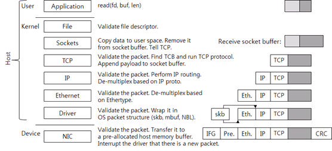
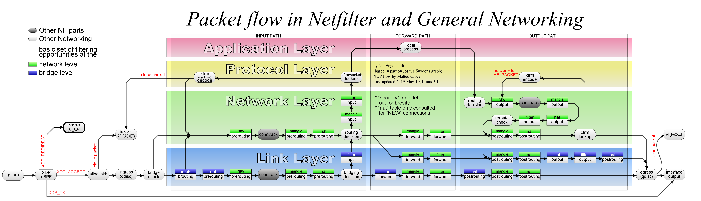
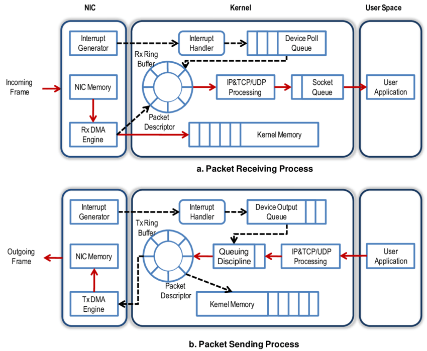
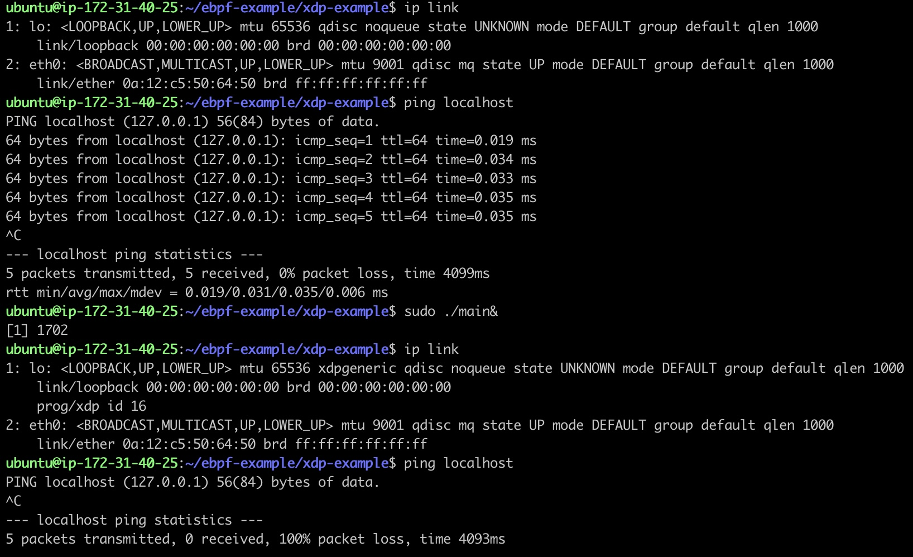
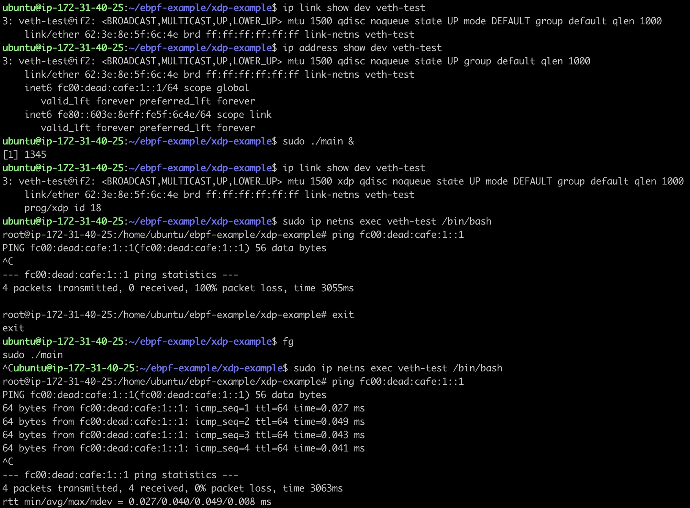

# Linux Networking
## linux network stack


## Packet Process
### overview

패킷은 리눅스 내의 여러 네트워크 계층의 지정된 로직에 따라 처리되고 있습니다.

### NIC

송/수신 패킷은 호스트 상의 메인 메모리에 존재하는 링버퍼에 적재됩니다. \
이후 인터럽트, `NAPI`의 방법을 이용해 패킷을 처리합니다. \
이 과정에서 `SKB`라고 불리는 소켓 버퍼에 내용들을 복사합니다.

## XDP
## overview
XDP는 eBPF hook의 한 종류로 네트워크 드라이버 내에서 동작하는 명령어 집합입니다. \
네트워크 드라이버가 XDP를 지원하는 경우 eBPF로 작성된 코드는 `Driver Space`에서 작동합니다. \
특히 [패킷 플로우](#over-view)을 보면 `XDP eBPF`가 `alloc_skb` 이전에 실행되는것을 알 수 있습니다. \
이로 인해 `Socket Filter eBPF`보다 오버헤드가 적음을 알 수 있습니다. \
네트워크 드라이버가 XDP를 지원하지 않는 경우 `Generic` 모드는 `SKB`할당 이후 처리되기 때문에 성능적 손실이 있습니다. \
NIC에서 실행한 `XDP eBPF`에 따라 패킷 처리가 달라집니다.
```c
// include/uapi/linux/bpf.h
enum xdp_action {
	XDP_ABORTED = 0,
	XDP_DROP,
	XDP_PASS,
	XDP_TX,
	XDP_REDIRECT,
};
```
* XDP_ABORTED: 패킷을 버리고 xdp_exception을 발생시킴
* XDP_DROP: 패킷을 버림
* XDP_PASS: 패킷을 커널로 보냄
* XDP_TX: 패킷을 수신된 인터페이스로 재전송
* XDP_REDIRECT: 패킷을 다른 인터페이스로 전달

```c
// include/uapi/linux/bpf.h
struct xdp_md {
	__u32 data;
	__u32 data_end;
	__u32 data_meta;
	/* Below access go through struct xdp_rxq_info */
	__u32 ingress_ifindex; /* rxq->dev->ifindex */
	__u32 rx_queue_index;  /* rxq->queue_index  */

	__u32 egress_ifindex;  /* txq->dev->ifindex */
};
```
`xdp_md` 구조체에는 패킷의 시작인 `data`와 끝인 `data_end`에 해당하는 주소가 담겨져 있습니다.


### XDP example
**xdp.c**
```c
#include <linux/bpf.h>
#include <bpf/bpf_helpers.h>

/*
clang -O2 -Wall -target bpf -g -c xdp.c -o xdp.o
*/

SEC("xdp")
int xdp_pass(struct xdp_md *ctx) {
	return XDP_PASS;
}

SEC("xdp")
int xdp_drop(struct xdp_md *ctx) {
	return XDP_DROP;
}

char _license[] SEC("license") = "GPL";
```

**main.go**
```go
package main

import (
	"log"
	"net"
	"os"
	"os/signal"
	"syscall"

	"github.com/cilium/ebpf"
	"github.com/cilium/ebpf/link"
)

func main() {
	sig := make(chan os.Signal, 1)
	signal.Notify(sig, os.Interrupt, syscall.SIGTERM)

	coll, err := ebpf.LoadCollection("xdp.o")
	if err != nil {
		log.Fatal(err)
	}

	ifce, err := net.InterfaceByName("lo")
	if err != nil {
		log.Fatal(err)
	}

	l, err := link.AttachXDP(link.XDPOptions{
		Program:	coll.Programs["xdp_drop"],
		Interface:	ifce.Index,
	})
	if err != nil {
		log.Fatal(err)
	}
	defer l.Close()

	<-sig
}
```

**dev lo - result**


**dev veth - result**

